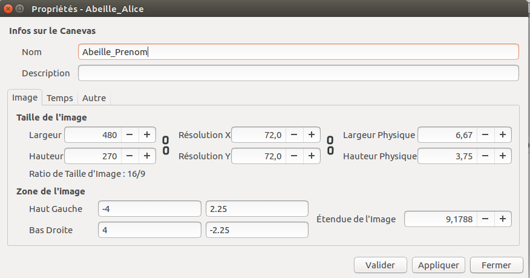
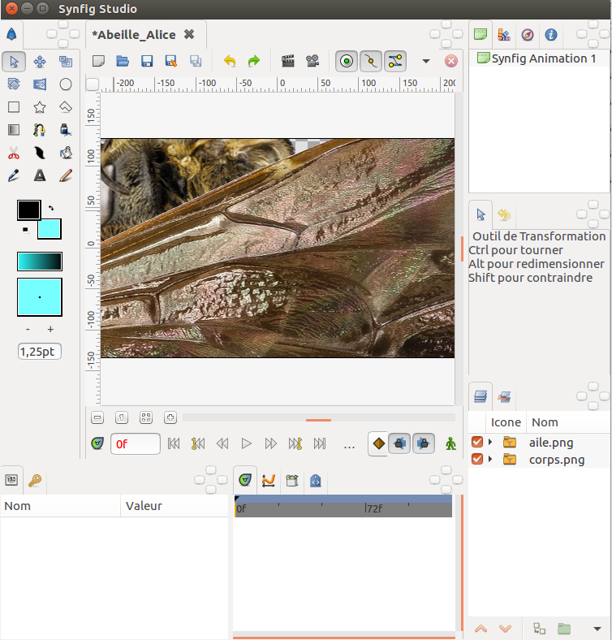
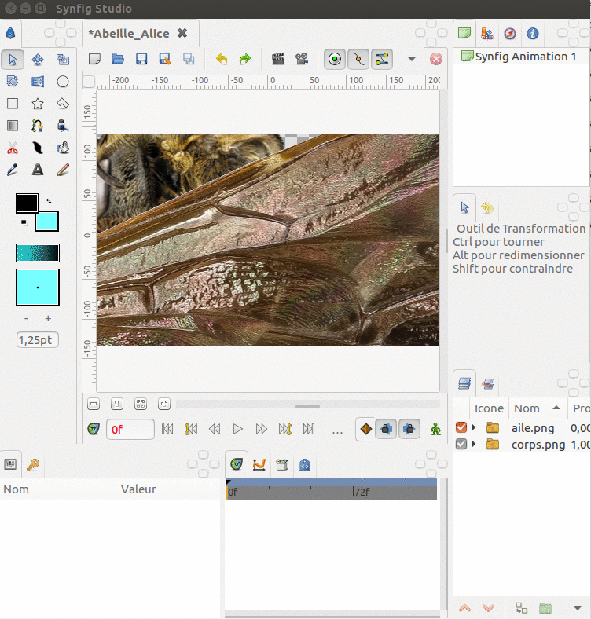

# Synfig, animer une abeille

- **Niveau** : **Débutant** / Intermédiaire / Avancé / Expert
- **Auteur** : Vincent Bergeot
- **Date de MàJ** : 22/03/2018
- **Licence** : CC-BY-SA

## Principes - Ce que nous allons faire

- Animer les ailes d'une abeille sur un paysage de fleurs

## Ingrédients - Ce dont nous avons besoin

- des dessins
    - d'une aile d'abeille
    - d'un corps d'abeille sans les ailes
    - d'un paysage de fleurs
- Synfig studio

## Étapes - Comment allons-nous procéder ?

- Ouvrir Synfig Studio 
- définir la taille du canevas (Canevas / propriétés (F8)), surtout le nom, on va garder le reste,
- insérer le corps et **une** aile (soit fichier importer, soit glisser déposer) 
    - nommer les calques,
    - s'assurer que l'origine est bien à la pointe de l'aile, sinon l'adapter,
    - adapter la taille de chaque partie,
- regrouper le corps et **une** aile dans un groupe "abeille",
    - sélectionner les 2 calques avec Ctrl puis Grouper les calques,
- animer l'aile,
    - sélectionner le calque "aile",
    - dans les propriétés, déplier transformations
    - sélectionner Angle, clic droit, convertir, mettre aléatoire
        - visualiser l'animation, 
        - jouer ensuite sur Rayon et Vitesse,
- dupliquer l'aile, la décaler et l'associer au corps,
    - on peut jouer sur quelques paramêtres pour que cela ne soit pas trop synchronisés, sinon cela marche bien déjà,
- sur le groupe "Abeille", clic droit, nouveau calque, transformer, décaler, insérer le décalage dans le groupe,
- pour ce calque Décaler, clic droit dans propriétés, sur Origine, Convertir, Aléatoire
    - on visualise le mouvement,
- puis sur l'ensemble du groupe, passer en édition du déplacement
    - sur le premier point, mettre en limite d'image
    - sur le dernier point mettre en limite de sortie
        - visualiser le déplacement, linéaire et aléatoire :)
- Fichier, rendu (F9),bien préciser .gif !

- Multiplions les abeilles

**Option**

- ajouter le fond
- animer le fond, déplacement !

## Aller + loin : 

Quelques ressources : 

- [le site de Synfig](https://www.synfig.org/)
- [Quelques tutoriels en ligne](https://wiki.synfig.org/Category:Tutorials/fr),
- [Une vidéo qui m'a beaucoup guidé](https://www.youtube.com/watch?annotation_id=annotation_3126018257&feature=iv&src_vid=odlPI6hfnDM&v=WAB6HrOTw0Q),

## A savoir :

**Contexte** : cette fiche est utilisée dans le cadre du dispositif des [Juniors du Développement Durable de Bordeaux Métropole](http://www.juniorsdudd.bordeaux-metropole.fr/), auprès d'une classe de CE2 de l'école Jules Michelet à Villenave d'Ornon. 1h15 par 1/2 classe, en salle informatique. Intervenant : Vincent Bergeot [Num&Lib](https://numetlib.fr).

Les enfants ont déja les dessins du corps, des ailes et des fonds de carte.

## Liens avec d’autres fiches : 

