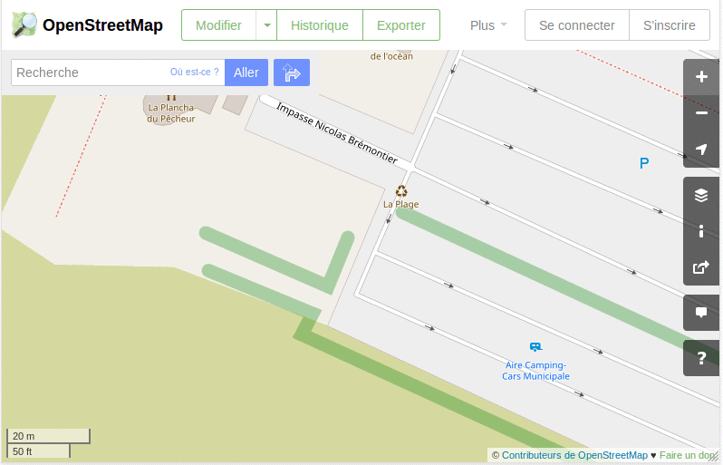
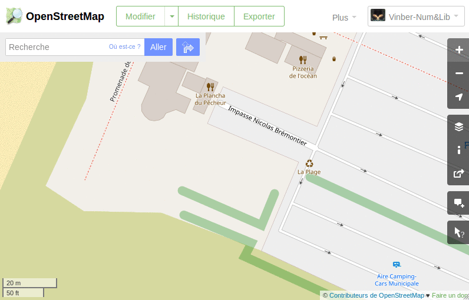
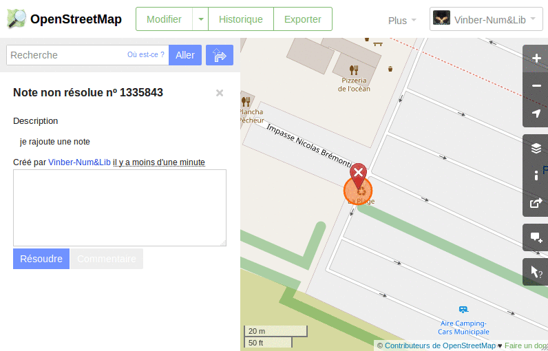
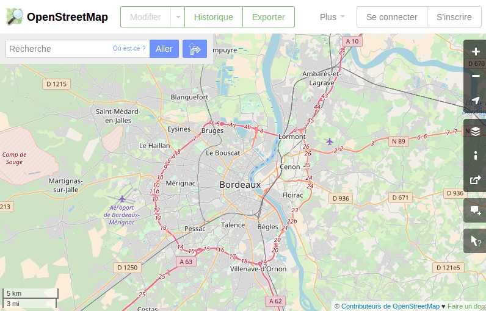

# Ajout d'une note dans OSM

- **Niveau** : **Débutant** / Intermédiaire / Avancé / Expert
- **Auteur** : Vincent Bergeot
- **Date de MàJ** : 23/03/2018
- **Licence** : CC-BY-SA

## Principes - Ce que nous allons faire

- Ajouter une note dans OpenStreetMap pour signaler une erreur, une amélioration, une modification
    1. en mode anonyme, sans compte,
    2. avec un compte OpenStreetMap,

## Ingrédients - Ce dont nous avons besoin

- Un navigateur et une connection internet,
- Avoir constaté une erreur, un manque, une amélioration sur OpenStreetMap,
- Un compte OpenStreetMap,

## Étapes - Comment allons-nous procéder ?

### Anonyme,

- Ouvrir le navigateur,
- Se rendre sur OpenStreetMap
    - [https://openstreetmap.org](https://openstreetmap.org),
    - [https://osm.org](https://osm.org),
- Se rendre sur l'endroit concerné,

*En haut à droite, se connecter est visible, signe qu'aucun compte OpenStreetMap est utilisé*

### Connecté

- Ouvrir le navigateur,
- Se rendre sur OpenStreetMap
    - [https://openstreetmap.org](https://openstreetmap.org),
    - [https://osm.org](https://osm.org),
- Se rendre sur l'endroit concerné,
- S'identifier avec son compte,

### Commenter une note et la résoudre

- je peux commenter des notes d'autres contributeurs ou les miennes,
- lorsque les modifications ont été faites, je résous les notes pour indiquer que ce n'est plus à traiter,

### Voir les notes autour de moi

- Par défaut les notes ne sont pas visibles,

## Aller + loin : 
Quelques sources : 

- le wiki.openstreetmap.org

## A savoir : 

Le fait de se connecter avec son compte lors de l'ajout de note ou de réponse à des notes permet d'être ensuite tenu au courant lorsque ces notes sont modifiées par d'autres contributeurs.

## Liens avec d’autres fiches : 

- Se créer un compte OpenStreetMap (à faire)
    - vérifier la question de la licence des données !

