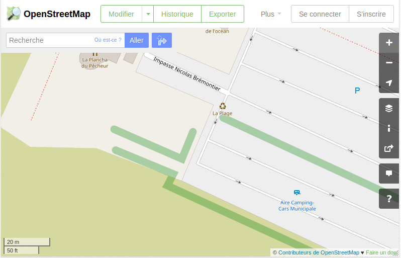

# Modifier OSM avec l'éditeur en ligne iD

- **Niveau** : **Débutant** / Intermédiaire / Avancé / Expert
- **Auteur** : Vincent Bergeot
- **Date de MàJ** : 23/03/2018
- **Licence** : CC-BY-SA

## Principes - Ce que nous allons faire

- Modifier OpenStreetMap pour corriger une erreur, apporter une amélioration,

## Ingrédients - Ce dont nous avons besoin

- Un navigateur et une connection internet,
- Avoir constaté une erreur, un manque, une amélioration sur OpenStreetMap,
- Un compte OpenStreetMap,

## Étapes - Comment allons-nous procéder ?

### Se connecter,

- Ouvrir le navigateur,
- Se rendre sur OpenStreetMap
    - [https://openstreetmap.org](https://openstreetmap.org),
    - [https://osm.org](https://osm.org),
- Se rendre en haut à droite,
- S'identifier,

**image à modifier**

*En haut à droite, l'identifiant est visible, signe que vous êtes connecté.*

### Passer en mode de modification,

- Par défaut si on clique sur Modifier c'est l'éditeur iD en ligne qui s'ouvre (
- On a alors des photographies aériennes et les données OpenStreetMap en "sur-impression",
- Sur le menu de droite vertical, on peut définir les "Paramètres du fond de carte" (raccourci clavier B) ainsi que les "Données Cartographiques" visibles (raccourci clavier F),
    - **Paramètres du fond de carte** : pour choisir entre les différentes sources de photographies aériennes, le cadastre mais également d'autres calques de données (type traces gps OSM, d'autres sources d'analyses). Il est également possible de modifier les Options d'affichaes et d'ajuster le décalage du fond de carte)
    - **Données Cartographiques** : pour choisir quelles données OSM sont visibles (par défaut toutes) et également voir les données provenant de Mapillary,

**Refaire l'image
**

### Ajouter un point

### Supprimer un point

### Modifier un point

## Aller + loin : 
Quelques sources : 

- le wiki.openstreetmap.org

## A savoir : 

Le fait de se connecter avec son compte lors de l'ajout de note ou de réponse à des notes permet d'être ensuite tenu au courant lorsque ces notes sont modifiées par d'autres contributeurs.

## Liens avec d’autres fiches : 

- Se créer un compte OpenStreetMap (à faire)
    - vérifier la question de la licence des données !

