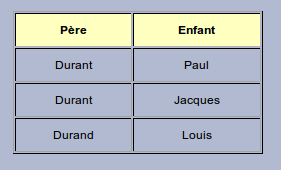

# Vous avez dit BDD ?

- **Niveau** : **Débutant** / Intermédiaire / Avancé / Expert
- **Auteur** : Vincent Bergeot
- **Date de MàJ** : 06/01/2016
- **Licence** : CC-by-sa

## Objectifs de cette présentation
Découvrir les bases de données :

- Définition
- Quelques abréviations
- Quelques ordres de grandeurs
- Contruire une base de données

## Définition
*Une base de données (en anglais : database) est un outil permettant de stocker et de retrouver l'intégralité de données brutes ou d'informations en rapport avec un thème ou une activité ; celles-ci peuvent être de natures différentes et plus ou moins reliées entre elles. Dans la très grande majorité des cas, ces informations sont très structurées, et la base est localisée dans un même lieu et sur un même support.*

https://fr.wikipedia.org/wiki/Base_de_donn%C3%A9es

## Différence entre tableur et base de données

### Pour faire cette table

## Quelques abréviations
- bdd -> Base de données
- sgbd -> Système de Gestion de Base de Données
- ODbL -> Open Database License

## Quelques ordres de grandeurs
de quelques mégaoctets à plusieurs téraoctet

## Contruire une base de données ou un tableur
L'organisation, la structuration 

## Aller + loin : 
Quelques sources : 

## A savoir : 

## Cadre d'utilisation
