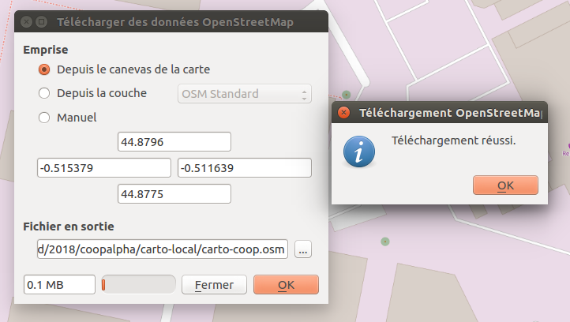
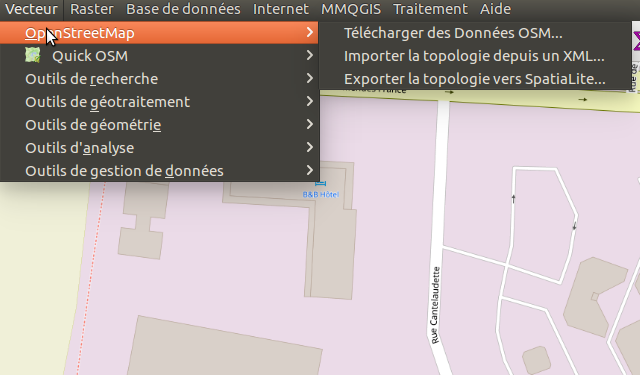

# Le titre de la fiche

- **Niveau** : Débutant / **Intermédiaire** / Avancé / Expert
- **Auteur** : Vincent Bergeot
- **Date de MàJ** : 01/03/2018
- **Licence** : CC-BY
- [Pour revenir au dépot](http://datalunch.datalocale.fr)

## Principes - Ce que nous allons faire

- contruire la base de données spatialite en partant de données OSM en utilisant Qgis

## Ingrédients - Ce dont nous avons besoin

- qgis (ici testé avec 2.18)
- connection internet

## Étapes - Comment allons-nous procéder ?

- ouvrir qgis
- mettre un fond de carte pour savoir quoi télécharger
- zoomer sur la zone souhaitée
- dans vecteur/openstreetmap, choisir l'emprise depuis le canevas de la carte (si il y a une erreur s'assurer que le système de coordonnées est bien calculé à la volée)
- renseigner le fichier de sortie, sans oublier de préciser l'extension .osm
- faire ok
- confirmation du téléchargement

- Fermer cette fenêtre "Télécharger des données OSM"

- Importer la topologie depuis un xml
    - choisir le fichier osm téléchargé
    - par défaut cela créé une base spatialite au même endroit
    - fermer Import OpenStreetMap
- Exporter la topologie OSM en SpatiaLite
    - choisir le fichier .db créé avant
    - et pour chaque type d'objet (point, way, poly)
        - charger depuis une base, sélectionner tout (ou pas !)
        - ok -> export réussi
        - répéter pour les trois types d'objets

On obtient un projet qgis avec 3 couches dans une spatialite

Problème / j'ai l'impression que cela ne télécharge pas tous les objets !!!!

Cela fonctionne mieux en faisant le téléchargement des données depuis JOSM, enregistrer un fichier .osm puis reprendre à partir d'importer topologie

## Aller + loin : 
Quelques sources : 

## A savoir : 

## Liens avec d’autres fiches : 

